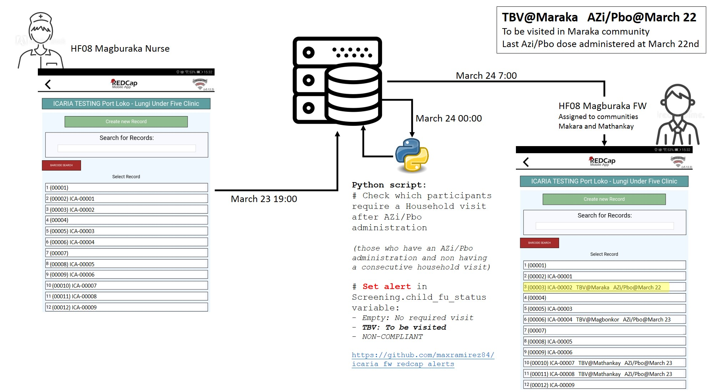
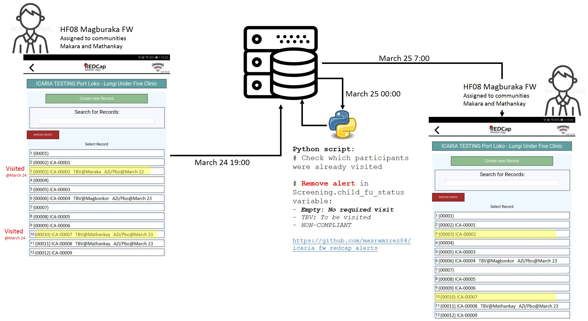

# ICARIA REDCap Alerts for Field Workers
Python script to setup alerts for ICARIA field workers. These alerts are for them to know if they have to do a household visit after AZi/Pbo administration or a Non-Compliant visit. In the context of the ICARIA Clinical Trial, a household visit is scheduled few days after the administration of the investigational product (azithromycin in this case). Moreover, if study participants are not coming to the scheduled study visits, another household visit will be scheduled to capture their status. 

This script is computing regularly which of the participants requires a household or Non-Compliant visit. This requirement is saved into an eCRF variable in the Screening DCI. This variable will be setup as part of the REDCap custom record label. Like this, field workers will see in a glance which participants they need to
visit at their households.

## Set alert workflow

## Remove alert workflow
